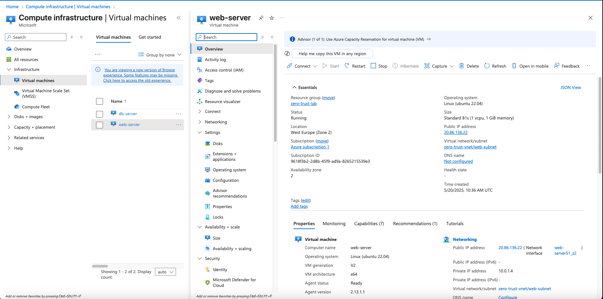

# 🛡️ Zero Trust Mini Network – Azure-Based Secure Architecture

A hands-on cybersecurity project to demonstrate secure network segmentation using **Azure**, **Linux**, and **MySQL**. This project sets up a real-world style **Zero Trust environment**, enforcing strict network access controls between application and database layers—ideal for portfolios, job applications, and Erasmus/DAAD scholarship submissions.

---

## 📌 Project Overview

This project simulates a secure micro-network with:

* Two Linux VMs on isolated subnets
* NSG-based Zero Trust firewall rules
* No public access to sensitive servers
* Strict IP and port-based communication

**Use Case:** Web server can access database, but database is fully locked down from outside world. No unnecessary access allowed.

---

## 🧱 Architecture Diagram

```
                Your Mac (SSH Client)
                        |
                [Public IP Access]
                        ↓
                ┌──────────────────┐
                │   web-server     │
                │ 10.0.1.4 (pub)   │
                └──────────────────┘
                        |
                 [Port 3306 only]
                        ↓
                ┌──────────────────┐
                │   db-server      │
                │ 10.0.2.4 (priv)  │
                └──────────────────┘
```

---

## ⚙️ Tools & Tech Stack

| Component      | Tech Used                  |
| -------------- | -------------------------- |
| Cloud Platform | Microsoft Azure            |
| OS             | Ubuntu Server 22.04 LTS    |
| Firewall       | Azure NSG + UFW (optional) |
| Database       | MySQL Server               |
| Language       | Bash, SQL                  |

---

## 🚀 Deployment Steps

### ✅ Step 1: Create Resource Group

* **Name:** `zero-trust-lab`
* **Region:** `West Europe`

### ✅ Step 2: Virtual Network & Subnets

* **VNet Name:** `zero-trust-vnet`
* **Address space:** `10.0.0.0/16`

  * Subnet `web-subnet`: `10.0.1.0/24`
  * Subnet `db-subnet`: `10.0.2.0/24`

### ✅ Step 3: Create VMs

#### `web-server`

* Subnet: `web-subnet`
* Public IP: ✅ Yes
* Inbound NSG rules:

  * Allow SSH (22) from your IP
  * Allow HTTP (80) from all

#### `db-server`

* Subnet: `db-subnet`
* Public IP: ❌ None
* Inbound NSG rules:

  * Allow MySQL (3306) only from `10.0.1.4`

### ✅ Step 4: Configure MySQL on `db-server`

1. Login via Azure Serial Console
2. Install MySQL:

```bash
sudo apt update && sudo apt install mysql-server -y
```

3. Edit config:

```bash
sudo nano /etc/mysql/mysql.conf.d/mysqld.cnf
```

Replace:

```ini
bind-address = 127.0.0.1
```

With:

```ini
bind-address = 0.0.0.0
```

4. Restart MySQL:

```bash
sudo systemctl restart mysql
```

---

## 🔐 MySQL User Setup

Run on `db-server`:

```sql
CREATE USER 'webapp'@'10.0.1.4' IDENTIFIED BY 'SuperSecurePass!';
GRANT ALL PRIVILEGES ON *.* TO 'webapp'@'10.0.1.4';
FLUSH PRIVILEGES;

CREATE USER 'webapp'@'web-server.internal.cloudapp.net' IDENTIFIED BY 'SuperSecurePass!';
GRANT ALL PRIVILEGES ON *.* TO 'webapp'@'web-server.internal.cloudapp.net';
FLUSH PRIVILEGES;
```

---

## ✅ Tests & Validation

### 1. Ping from `web-server` to `db-server`

```bash
ping 10.0.2.4
```

✅ Output:

```
64 bytes from 10.0.2.4: icmp_seq=0 ttl=64 time=0.41 ms
```

### 2. Test MySQL port (should succeed):

```bash
nc -zv 10.0.2.4 3306
```

✅ Output:

```
Connection to 10.0.2.4 port 3306 succeeded!
```

### 3. Test denied port (SSH to db-server)

```bash
nc -zv 10.0.2.4 22
```

✅ Output:

```
Connection timed out
```

### 4. MySQL Connection Test

```bash
mysql -h 10.0.2.4 -u webapp -p
```

✅ Output:

```
Welcome to the MySQL monitor...
mysql>
```

---

## 🖼️ Key Screenshots

### 📷 1. Azure Resource Group


### 📷 2. Virtual Network + Subnets


### 📷 3. Web Server VM Overview


### 📷 4. DB Server VM Overview


### 📷 5. NSG Rules – Web Server


### 📷 6. NSG Rules – DB Server


### 📷 7. Serial Console Access to DB


### 📷 8. MySQL `bind-address` Configuration


### 📷 9. MySQL CLI Login Prompt


---

## 🧠 Why It Matters

This project demonstrates:

* Network segmentation
* Least-privilege architecture
* Hands-on NSG rule creation
* Real Linux server config experience
* Live secure connection testing

---

## 📂 Project Structure

```bash
zero-trust-mini-network/
├── README.md
├── setup/
├── mysql-config/
├── test-results/
├── screenshots/
```

---

## 🏁 Final Notes

✅ Built and tested end-to-end on Azure
✅ Portfolio and scholarship application ready
✅ Real-world architecture in small footprint

---

**Author:** [Md Tanvir Rana](https://github.com/tanviiiiir-r)

Feel free to ⭐️ the repo or fork and extend it!
