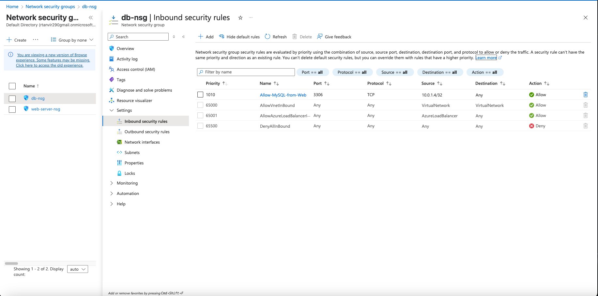

# 🔹 Network Security Groups (NSG) Configuration

## NSG: web-nsg
| Priority | Name           | Port | Source       | Action |
|----------|----------------|------|--------------|--------|
| 100      | Allow-SSH-MyIP | 22   | My IP        | Allow  |
| 200      | Allow-HTTP     | 80   | Any          | Allow  |
| 65500    | DenyAllInbound | *    | *            | Deny   |

## NSG: db-nsg
| Priority | Name                   | Port | Source       | Action |
|----------|------------------------|------|--------------|--------|
| 100      | Allow-MySQL-from-Web   | 3306 | 10.0.1.4/32  | Allow  |
| 65500    | DenyAllInbound         | *    | *            | Deny   |

See visual rules in:

