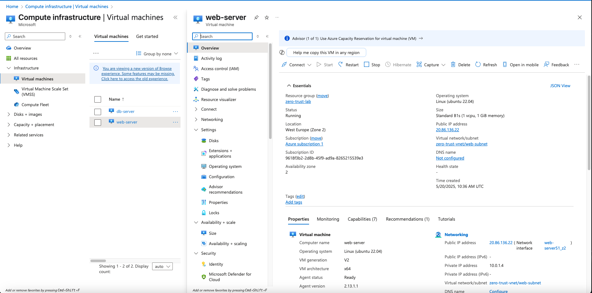
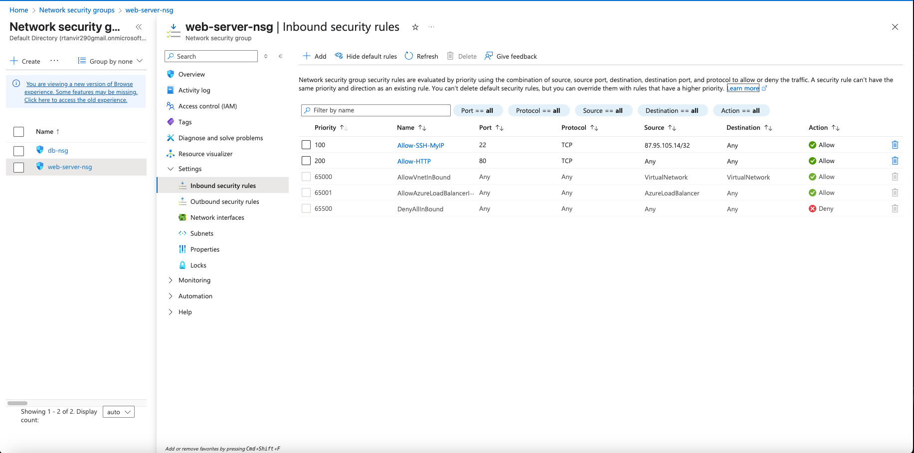

# 🔹 Web Server VM Configuration

- **VM Name:** `web-server`
- **Region:** West Europe
- **Size:** B1s
- **Image:** Ubuntu 22.04 LTS
- **Subnet:** `web-subnet`
- **Public IP:** ✅ Yes
- **NSG:** `web-nsg`

## NSG Rules:
- Allow SSH (port 22) from My IP
- Allow HTTP (port 80) from Any

